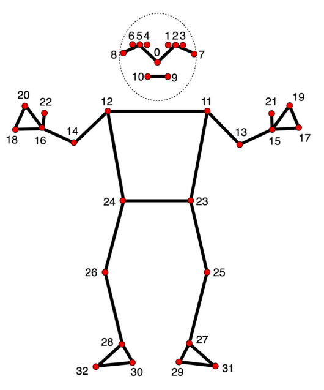

# BScThesis

This is the codebase for the experimental machine learning pipeline, developed specifically for the squat technique assessment and a comparative evaluation of a random forest ensamble and BiLSTM deep learning model.

## 🏋️‍♂️ Squat Form Analysis with MediaPipe & Machine Learning

This project uses **Machine Learning**, and **Computer Vision (Mediapipe)** to analyze squat form. The environment is set up using venv virtual environment to ensure reproducibility by containing all dependencies in there so that we can easily work together.

## 🚀 Getting Started
Follow these steps to set up your local development environment.

### **1. Clone the Repository**
```sh
git clone https://github.com/perujuice/BScThesis.git
cd BScThesis
```

### **2. Setup the virtual environment**
**Important** I used python version 3.11 because later versions don't work with mediapip
```sh
py -3.11 -m venv mediapipe-env
```

## **3. Activating the venv**
```sh
.\mediapipe-env\Scripts\Activate
```

## **4. Install dependencies**
```sh
pip install -r requirements.txt
```

## Now registering the venv as a jupyter kernel
```sh
python -m ipykernel install --user --name=mediapipe-env --display-name "Python (mediapipe-env)"
```

** Might have to install jupyter globally as well! **

## Pose landmark model by mediapipe

**This serves as a reference to the landmarks we are interested in.**



```sh
0 - nose
1 - left eye (inner)
2 - left eye
3 - left eye (outer)
4 - right eye (inner)
5 - right eye
6 - right eye (outer)
7 - left ear
8 - right ear
9 - mouth (left)
10 - mouth (right)
11 - left shoulder
12 - right shoulder
13 - left elbow
14 - right elbow
15 - left wrist
16 - right wrist
17 - left pinky
18 - right pinky
19 - left index
20 - right index
21 - left thumb
22 - right thumb
23 - left hip
24 - right hip
25 - left knee
26 - right knee
27 - left ankle
28 - right ankle
29 - left heel
30 - right heel
31 - left foot index
32 - right foot index
```


## Analysis of the squat before preprocessing raw data

Squat form can be evaluated based on key aspects such as:

    Knee Valgus (Inward knee collapse)
        - Seperately for each leg (left valgus angle, right valgus angle)
    Torso Lean (Excessive forward bending)
    Depth of the Squat (Hip below knee level)

## Extracting the feature keypoints
```sh
python preprocessing/process_videos.py
```

# Example result visualized
```sh
python preprocessing/video_landmarks.py
```
