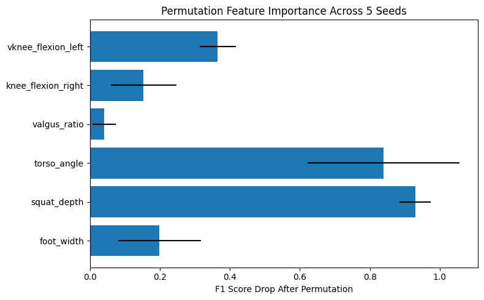
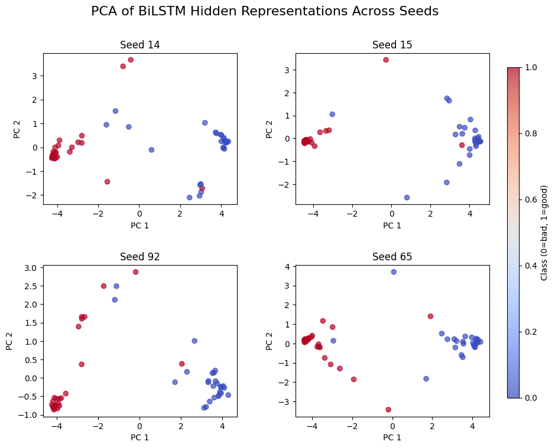
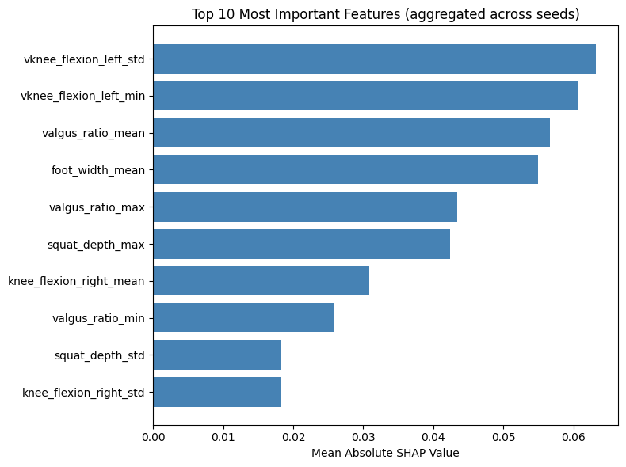
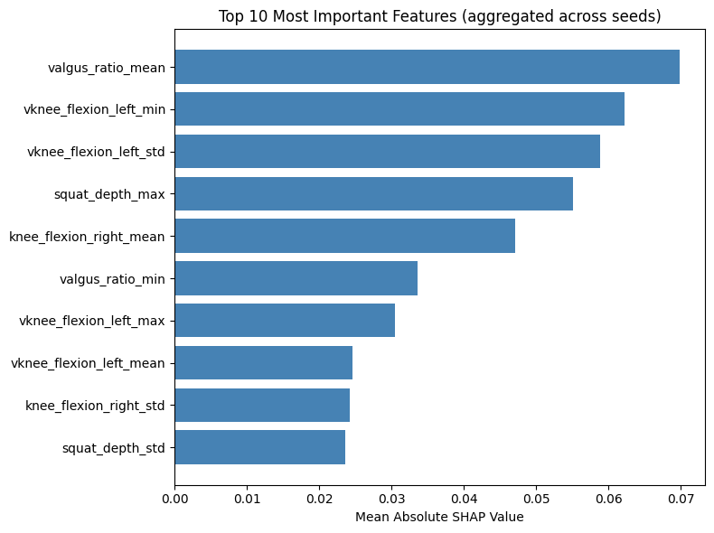
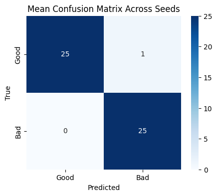
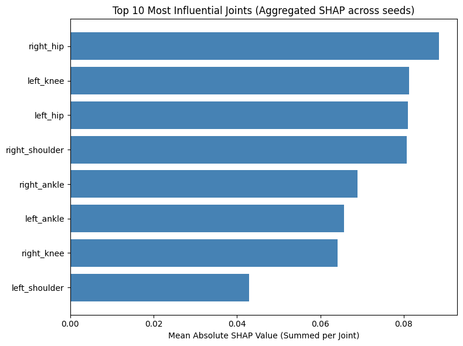
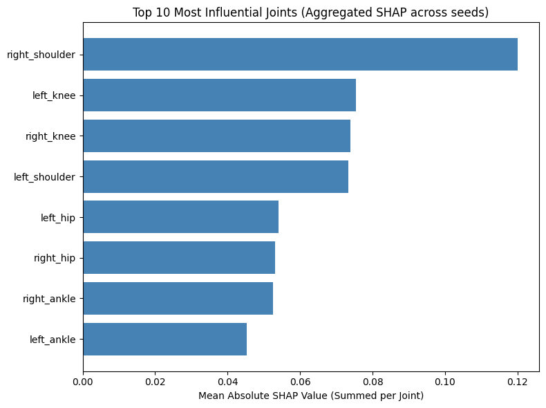

# BiLSTM with bio features, normalized and padded

## The first run was done using original data and this is the Cross Validation result

```sh
 Best Parameters: {'epochs': 100, 'model__dropout_rate': 0.3, 'model__learning_rate': 0.0003, 'model__lstm_units': 96}
 Best Cross-Validated Accuracy: 0.9450
    mean_test_score  std_test_score  \
25         0.945000        0.050990   
50         0.915244        0.058458   
52         0.915122        0.064534   
40         0.915000        0.048990   
43         0.905122        0.104246   

                                               params  
25  {'epochs': 100, 'model__dropout_rate': 0.3, 'm...  
50  {'epochs': 150, 'model__dropout_rate': 0.4, 'm...  
52  {'epochs': 150, 'model__dropout_rate': 0.4, 'm...  
40  {'epochs': 150, 'model__dropout_rate': 0.2, 'm...  
43  {'epochs': 150, 'model__dropout_rate': 0.3, 'm... 
```

## This is the evaluation using all 20 seeds to split the test set 20 times in various ways

```sh
 Final evaluation over multiple test splits:
Accuracy  : 0.8784 ± 0.0603
Precision : 0.8536 ± 0.0825
Recall    : 0.9220 ± 0.1016
F1        : 0.8809 ± 0.0629
Roc_auc   : 0.9566 ± 0.0450

 Mean Confusion Matrix (rounded):
[[22  4]
 [ 2 23]]
```

## Finally I included a representation of what features hurt the outcome most by using a technique callsed Permutation Feature Importance for the BiLSTM


# BiLSTM with bio features, but an augmented training set

## Initial step: Augment the training set from the first seed and tune the model

* Augmenting included adding gaussian noise to the original data set, repeated twice so the training set is essentially tripled in volume.
**Took 324mins**

```sh
 Best Parameters: {'epochs': 150, 'model__dropout_rate': 0.4, 'model__learning_rate': 0.0003, 'model__lstm_units': 96}
 Best Cross-Validated Accuracy: 0.9851
    mean_test_score  std_test_score  \
49         0.985124        0.019835   
16         0.985096        0.008103   
47         0.983471        0.018107   
53         0.981804        0.024733   
28         0.981804        0.019126   

                                               params  
49  {'epochs': 150, 'model__dropout_rate': 0.4, 'm...  
16  {'epochs': 50, 'model__dropout_rate': 0.4, 'mo...  
47  {'epochs': 150, 'model__dropout_rate': 0.3, 'm...  
53  {'epochs': 150, 'model__dropout_rate': 0.4, 'm...  
28  {'epochs': 100, 'model__dropout_rate': 0.3, 'm...  

```

# The evaluation followed the same procedure as before, but now on each seed we split and augment the training set (80%)
```sh
 Final evaluation over multiple test splits:
Accuracy  : 0.9480 ± 0.0347
Precision : 0.9431 ± 0.0619
Recall    : 0.9580 ± 0.0498
F1        : 0.9481 ± 0.0326
Roc_auc   : 0.9887 ± 0.0149

 Mean Confusion Matrix (rounded):
[[24  2]
 [ 1 24]]
 ```


## Permutation feature importance with augmented bio data



# BiLSTM with raw features, normalized and padded

## The first run was done using original data and this is the Cross Validation result

```sh
 Best Parameters: {'epochs': 100, 'model__dropout_rate': 0.2, 'model__learning_rate': 0.0005, 'model__lstm_units': 64}
 Best Cross-Validated Accuracy: 0.9554
    mean_test_score  std_test_score  \
21         0.955366        0.028785   
23         0.950366        0.031341   
22         0.950244        0.027390   
14         0.950244        0.027390   
25         0.950122        0.031720   

                                               params  
21  {'epochs': 100, 'model__dropout_rate': 0.2, 'm...  
23  {'epochs': 100, 'model__dropout_rate': 0.2, 'm...  
22  {'epochs': 100, 'model__dropout_rate': 0.2, 'm...  
14  {'epochs': 50, 'model__dropout_rate': 0.4, 'mo...  
25  {'epochs': 100, 'model__dropout_rate': 0.3, 'm...  
```

## This is the evaluation using all 20 seeds to split the test set 20 times in various ways

```sh
 Final evaluation over multiple test splits:
Accuracy  : 0.9569 ± 0.0281
Precision : 0.9564 ± 0.0368
Recall    : 0.9580 ± 0.0572
F1        : 0.9555 ± 0.0311
Roc_auc   : 0.9924 ± 0.0077

 Mean Confusion Matrix (rounded):
[[25  1]
 [ 1 24]]
 ```

 # BiLSTM with raw features, but an augmented training set

 ## Initial step: Augment the training set from the first seed and tune the model

 ```sh
  Best Parameters: {'epochs': 50, 'model__dropout_rate': 0.3, 'model__learning_rate': 0.0003, 'model__lstm_units': 96}
 Best Cross-Validated Accuracy: 1.0000

```
| mean_test_score | std_test_score | params                                                                 |
|-----------------|----------------|------------------------------------------------------------------------|
| 1.000000        | 0.000000       | {'epochs': 50, 'model__dropout_rate': 0.3, 'model__learning_rate': 0.0003, 'model__lstm_units': 96} |
| 1.000000        | 0.000000       | {'epochs': 50, 'model__dropout_rate': 0.3, 'model__learning_rate': 0.0003, 'model__lstm_units': 128} |
| 1.000000        | 0.000000       | {'epochs': 50, 'model__dropout_rate': 0.3, 'model__learning_rate': 0.0005, 'model__lstm_units': 96} |
| 0.998347        | 0.003306       | {'epochs': 50, 'model__dropout_rate': 0.3, 'model__learning_rate': 0.0005, 'model__lstm_units': 128} |
| 0.998347        | 0.003306       | {'epochs': 50, 'model__dropout_rate': 0.2, 'model__learning_rate': 0.0003, 'model__lstm_units': 96} |
```
Total tuning time: 65.74 minutes
```

## Again The evaluation followed the same procedure as before, but now on each seed we split and augment the training set (80%)

```sh
 Final evaluation over multiple test splits:
Accuracy  : 0.9461 ± 0.0231
Precision : 0.9421 ± 0.0362
Recall    : 0.9500 ± 0.0307
F1        : 0.9454 ± 0.0231
Roc_auc   : 0.9913 ± 0.0067

 Mean Confusion Matrix (rounded):
[[24  2]
 [ 1 24]]
```


## PCA graph since permutation features don't help much (Im not entirely sure about this yet)





 # Random forest Experiement

 ## Original data Bio handcrafted feature hyperparameter tuning grid search 5 fold CV

 ```sh
 ✅ Best Parameters: {'max_depth': 6, 'max_features': 'sqrt', 'min_samples_leaf': 1, 'min_samples_split': 2, 'n_estimators': 300}
✅ Best Cross-Validated Accuracy: 0.9552
     mean_test_score  std_test_score  \
191         0.955244        0.018649   
272         0.955244        0.018649   
245         0.955244        0.018649   
244         0.955244        0.018649   
164         0.955244        0.018649   

                                                params  
191  {'max_depth': 10, 'max_features': 'log2', 'min...  
272  {'max_depth': None, 'max_features': 'log2', 'm...  
245  {'max_depth': None, 'max_features': 'sqrt', 'm...  
244  {'max_depth': None, 'max_features': 'sqrt', 'm...  
164  {'max_depth': 10, 'max_features': 'sqrt', 'min...
```

## This is the evaluation using all 20 seeds to split the test set 20 times in various ways

```sh
 Final evaluation over multiple test splits:
Accuracy  : 0.9686 ± 0.0235
Precision : 0.9737 ± 0.0393
Recall    : 0.9640 ± 0.0307
F1        : 0.9681 ± 0.0234
Roc_auc   : 0.9959 ± 0.0051

 Mean Confusion Matrix (rounded):
[[25  1]
 [ 1 24]]
 ```

 


# Feature importance with mean shap values



# Bio features with augmented training set

## Augmented training set for biomechanical features hyperparameter tuning grid search 5 fold CV
* I had to normalize the data here to fairly augment the data! I think this was the best approach but we might need to look into it to confirm it! 

```sh
Best Parameters: {'max_depth': 9, 'max_features': 'sqrt', 'min_samples_leaf': 1, 'min_samples_split': 5, 'n_estimators': 300}
Best Cross-Validated Accuracy: 0.9735
```

| Accuracy ± Std      | max_depth | max_features | min_samples_leaf | min_samples_split | n_estimators |
|---------------------|-----------|--------------|------------------|-------------------|--------------|
| 0.9735 ± 0.0132     | None      | sqrt         | 1                | 5                 | 500          |
| 0.9735 ± 0.0132     | 14        | log2         | 1                | 5                 | 500          |
| 0.9735 ± 0.0132     | 9         | log2         | 1                | 5                 | 300          |
| 0.9735 ± 0.0132     | None      | log2         | 1                | 5                 | 500          |
| 0.9735 ± 0.0132     | 9         | sqrt         | 1                | 5                 | 300          |

## This is the evaluation using all 20 seeds to split the test set 20 times in various ways

| Metric     | Mean   | Std Deviation |
|------------|--------|---------|
| Accuracy   | 0.9735 | 0.0167  |
| Precision  | 0.9699 | 0.0341  |
| Recall     | 0.9780 | 0.0236  |
| F1 Score   | 0.9733 | 0.0166  |
| ROC AUC    | 0.9973 | 0.0043  |


# Feature importance with mean shap values - bio data aug




# Raw data Process! 

 # Original data raw feature hyperparameter tuning grid search 5 fold CV

 ```sh
Best Parameters: {'max_depth': 9, 'max_features': 'sqrt', 'min_samples_leaf': 1, 'min_samples_split': 10, 'n_estimators': 100}
 Best Cross-Validated Accuracy: 0.9900
     mean_test_score  std_test_score  \
168             0.99        0.012247   
87              0.99        0.012247   
255             0.99        0.012247   
6               0.99        0.012247   
249             0.99        0.012247   

                                                params  
168  {'max_depth': 29, 'max_features': 'sqrt', 'min...  
87   {'max_depth': 19, 'max_features': 'sqrt', 'min...  
255  {'max_depth': None, 'max_features': 'sqrt', 'm...  
6    {'max_depth': 9, 'max_features': 'sqrt', 'min_...  
249  {'max_depth': None, 'max_features': 'sqrt', 'm... 
```

## This is the evaluation using all 20 seeds to split the test set 20 times in various ways

```sh
 Final evaluation over multiple test splits:
Accuracy  : 0.9676 ± 0.0279
Precision : 0.9547 ± 0.0391
Recall    : 0.9820 ± 0.0296
F1        : 0.9677 ± 0.0278
Roc_auc   : 0.9944 ± 0.0062

🧩 Mean Confusion Matrix (rounded):
[[25  1]
 [ 0 25]]
```
* I just put this figure here because they are the same for non aug and aug in terms of the confusion matrix! 



## Feature Importance with SHAP values


# Raw data Process! But now with the Augmented training set


## Hyperparameter tuning!

```sh
Best Parameters: {'max_depth': 9, 'max_features': 'log2', 'min_samples_leaf': 1, 'min_samples_split': 2, 'n_estimators': 300}

Best Cross-Validated Accuracy: 0.9934
```

| Accuracy ± Std Dev | max_depth | max_features | min_samples_leaf | min_samples_split | n_estimators |
|--------------------|-----------|---------------|------------------|-------------------|--------------|
| 0.9934 ± 0.0081    | 19        | log2          | 1                | 2                 | 300          |
| 0.9934 ± 0.0062    | 9         | log2          | 1                | 2                 | 300          |
| 0.9934 ± 0.0081    | None      | log2          | 1                | 2                 | 300          |
| 0.9934 ± 0.0081    | 19        | log2          | 1                | 2                 | 500          |
| 0.9934 ± 0.0081    | None      | log2          | 1                | 2                 | 500          |


## Evaluation with the test set!


| Metric     | Mean   | Std Dev |
|------------|--------|---------|
| Accuracy   | 0.9696 | 0.0300  |
| Precision  | 0.9567 | 0.0405  |
| Recall     | 0.9840 | 0.0320  |
| F1 Score   | 0.9697 | 0.0301  |
| ROC AUC    | 0.9938 | 0.0075  |


## Feature Importance with SHAP values - Aug data

* For the features here, I grouped them so that for example joint_x, joint_y and joint_z is represented as one feature in the graph (summed up shap values)

