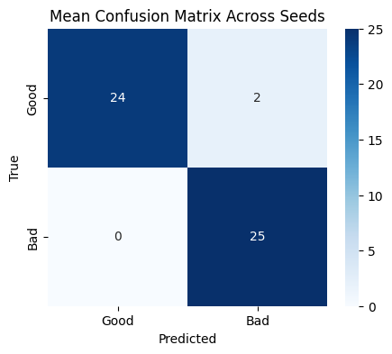
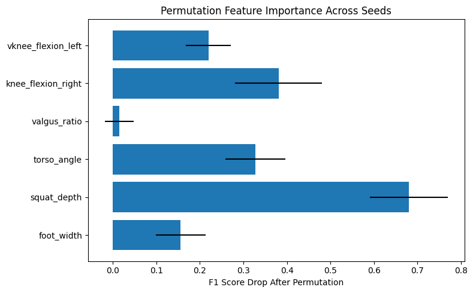
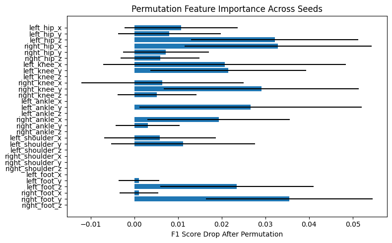
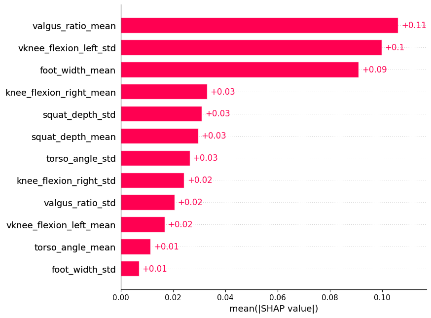
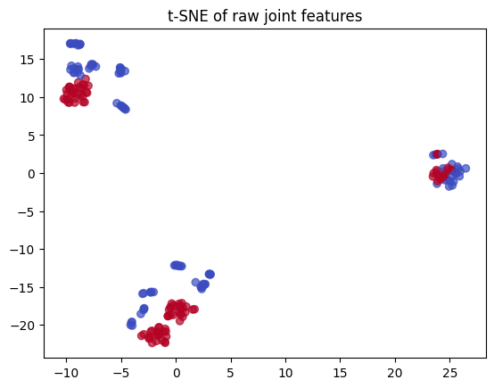

# BiLSTM with bio features, normalized and padded

## The first run was done using original data and this is the Cross Validation result

```sh
 Best Parameters: {'epochs': 100, 'model__dropout_rate': 0.3, 'model__learning_rate': 0.0003, 'model__lstm_units': 96}
 Best Cross-Validated Accuracy: 0.9450
    mean_test_score  std_test_score  \
25         0.945000        0.050990   
50         0.915244        0.058458   
52         0.915122        0.064534   
40         0.915000        0.048990   
43         0.905122        0.104246   

                                               params  
25  {'epochs': 100, 'model__dropout_rate': 0.3, 'm...  
50  {'epochs': 150, 'model__dropout_rate': 0.4, 'm...  
52  {'epochs': 150, 'model__dropout_rate': 0.4, 'm...  
40  {'epochs': 150, 'model__dropout_rate': 0.2, 'm...  
43  {'epochs': 150, 'model__dropout_rate': 0.3, 'm... 
```

## This is the evaluation using all 20 seeds to split the test set 20 times in various ways

```sh
Final evaluation over multiple test splits:
Accuracy  : 0.9588 ± 0.0316
Precision : 0.9280 ± 0.0488
Recall    : 0.9960 ± 0.0120
F1        : 0.9602 ± 0.0294
Roc_auc   : 0.9844 ± 0.0171

Mean Confusion Matrix (rounded):
[[24  2]
 [ 0 25]]
```



## Finally I included a representation of what features hurt the outcome most by using a technique callsed Permutation Feature Importance for the BiLSTM




# BiLSTM with raw features, normalized and padded

## The first run was done using original data and this is the Cross Validation result

```sh
 Best Parameters: {'epochs': 100, 'model__dropout_rate': 0.2, 'model__learning_rate': 0.0005, 'model__lstm_units': 64}
 Best Cross-Validated Accuracy: 0.9554
    mean_test_score  std_test_score  \
21         0.955366        0.028785   
23         0.950366        0.031341   
22         0.950244        0.027390   
14         0.950244        0.027390   
25         0.950122        0.031720   

                                               params  
21  {'epochs': 100, 'model__dropout_rate': 0.2, 'm...  
23  {'epochs': 100, 'model__dropout_rate': 0.2, 'm...  
22  {'epochs': 100, 'model__dropout_rate': 0.2, 'm...  
14  {'epochs': 50, 'model__dropout_rate': 0.4, 'mo...  
25  {'epochs': 100, 'model__dropout_rate': 0.3, 'm...  
```

## This is the evaluation using all 20 seeds to split the test set 20 times in various ways

```sh
 Final evaluation over multiple test splits:
Accuracy  : 0.9951 ± 0.0085
Precision : 1.0000 ± 0.0000
Recall    : 0.9900 ± 0.0173
F1        : 0.9949 ± 0.0088
Roc_auc   : 0.9986 ± 0.0027

🧩 Mean Confusion Matrix (rounded):
[[26  0]
 [ 0 25]]
 ```

 

 ## Finally I included a representation of what features hurt the outcome most by using a technique callsed Permutation Feature Importance for the BiLSTM
- Clearly less interpretable, the features dont tell us much about what went wrong but the model performs extremely well and consistently!

 


 # Random forest Experiement

 ## Original data Bio handcrafted feature hyperparameter tuning grid search 5 fold CV

 ```sh
 ✅ Best Parameters: {'max_depth': 6, 'max_features': 'sqrt', 'min_samples_leaf': 1, 'min_samples_split': 2, 'n_estimators': 300}
✅ Best Cross-Validated Accuracy: 0.9552
     mean_test_score  std_test_score  \
191         0.955244        0.018649   
272         0.955244        0.018649   
245         0.955244        0.018649   
244         0.955244        0.018649   
164         0.955244        0.018649   

                                                params  
191  {'max_depth': 10, 'max_features': 'log2', 'min...  
272  {'max_depth': None, 'max_features': 'log2', 'm...  
245  {'max_depth': None, 'max_features': 'sqrt', 'm...  
244  {'max_depth': None, 'max_features': 'sqrt', 'm...  
164  {'max_depth': 10, 'max_features': 'sqrt', 'min...
```

## This is the evaluation using all 20 seeds to split the test set 20 times in various ways

```sh
 Final evaluation over multiple test splits:
Accuracy  : 0.9971 ± 0.0070
Precision : 0.9942 ± 0.0137
Recall    : 1.0000 ± 0.0000
F1        : 0.9971 ± 0.0070
Roc_auc   : 1.0000 ± 0.0000

 Mean Confusion Matrix (rounded):
[[26  0]
 [ 0 25]]
 ```


## Finally I included a representation of what features affect the predictions of bad squats most using SHAP values for the RF

* This is done using the first seed (first 2 digits of pi) that then fix the randomness of the train/test split and will always produce this same result with that seed.




 ## Original data raw feature hyperparameter tuning grid search 5 fold CV

 ```sh
Best Parameters: {'max_depth': 9, 'max_features': 'sqrt', 'min_samples_leaf': 1, 'min_samples_split': 10, 'n_estimators': 100}
 Best Cross-Validated Accuracy: 0.9900
     mean_test_score  std_test_score  \
168             0.99        0.012247   
87              0.99        0.012247   
255             0.99        0.012247   
6               0.99        0.012247   
249             0.99        0.012247   

                                                params  
168  {'max_depth': 29, 'max_features': 'sqrt', 'min...  
87   {'max_depth': 19, 'max_features': 'sqrt', 'min...  
255  {'max_depth': None, 'max_features': 'sqrt', 'm...  
6    {'max_depth': 9, 'max_features': 'sqrt', 'min_...  
249  {'max_depth': None, 'max_features': 'sqrt', 'm... 
```

## This is the evaluation using all 20 seeds to split the test set 20 times in various ways

```sh
 Final evaluation over multiple test splits:
Accuracy  : 0.9912 ± 0.0116
Precision : 0.9828 ± 0.0223
Recall    : 1.0000 ± 0.0000
F1        : 0.9912 ± 0.0115
Roc_auc   : 0.9992 ± 0.0024

 Mean Confusion Matrix (rounded):
[[26  0]
 [ 0 25]]
```


# For the raw features I am not sure how to best visually represent them since they are very high dimensional (96 features for x,y,z + min, max, mean, std) but I came accross the t-distributed stochastic neighbor embedding

* Visualizing high-dimensional data in 2 or 3 dimensions, while preserving local structure (i.e., which points are close together)

**This kind of plot could good to show the structure of our data though!** 

